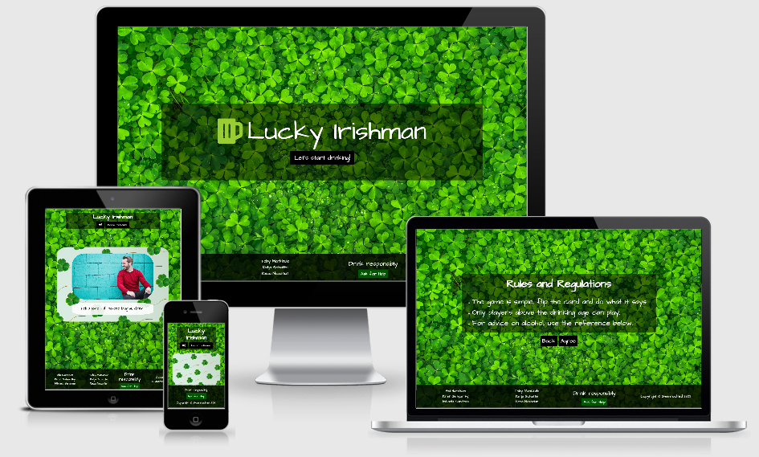
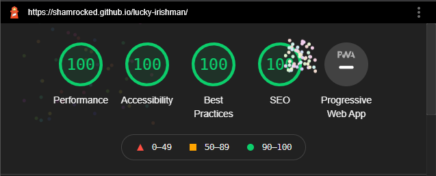
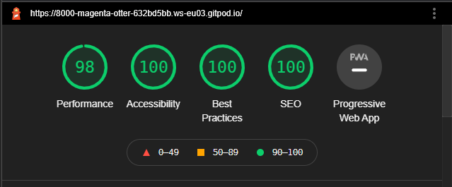

# Lucky Irishman

[Here is a link to the final project](https://shamrocked.github.io/lucky-irishman)

This is a drinking game site designed for people to be able to celebrate St. Patrick's Day together whilst apart.
It is designed to be responsive on a wide range of devices, whilst also being easy to navigate through. 
This was built as part of Code Institute's March 2021 Hackathon, with the theme of 'Hacking St. Patrick's Day'.

## Contents

* [User Experience (UX)](#user-experience-(ux))
    * [Initial Discussion](#initial-discussion)
    * [User Stories](#user-stories)

* [Design](#design)
    * [Color Scheme](#color-scheme)
    * [Typography](#typography)
    * [Imagery](#imagery)
    * [Wireframes](#wireframes)
    * [Features](#features)
    * [Audio](#audio)

* [Technologies Used](#technologies-used)
    * [Languages Used](#languages-used)
    * [Frameworks, Libraries & Programs Used](#frameworks-libraries-and-programs-used)

* [Deployment](#deployment)
    * [Initial Deployment](#initial-deployment)
    * [How to Fork it](#how-to-fork-it)
    * [How to Clone it](#how-to-clone-it)
    * [Making a Local Clone](#making-a-local-clone)

* [Testing](#testing)
    * [W3C Validator](#w3c-validator)
    * [Testing User Stories](#testing-user-stories)
    * [Full Testing](#full-testing)
    * [Further Testing](#further-testing)
    * [Solved Bugs](#solved-bugs)
    * [Known Bugs](#known-bugs)
    * [Lighthouse](#lighthouse)
        * [Performance](#performance)
        * [Accessibility](#accessibility)
        * [Best Practices](#best-practices)
        * [SEO](#seo)

* [Credits](#credits)
    * [Code](#code)
    * [Content](#content)
    * [Media](#media)
    * [Acknowledgements](#acknowledgements)

---
## User Experience (UX)
### Initial Discussion
We wanted this project to be an easy way for people to celebrate St. Patrick's Day together, whilst kept apart due to Coronavirus. It is designed to be playable over video 
conferencing, so people can still have drinks together and celebrate St. Patrick's Day whilst staying safe.

### User Stories
#### Client Goals
* For a user to be able to play a drinking game with friends or family.
* For a user to feel like they're celebrating St. Patrick's Day whilst Coronavirus restrictions are in place.

#### First Time Visitor Goals
* To be able to play a drinking game with a friend via video conferencing.
* Easy to navigate around the site.
* Clear and simple to understand instructions.

#### Returning Visitor Goals
* To be able to replay the game, and not have the same game experience.
* To be able to easily access medical advice if the situation required.

#### Frequent Visitor Goals
* To be able to replay the game, and not have the same game experience.
* To be able to easily access medical advice if the situation required.

---
## Design
### Color Scheme
* The colors used were shades of green, yellow and black, to link with the St. Patrick's Day theme.

### Typography
* The font 'Architect's Daughter' was used, as it's a relaxed font, which links with the theme of drinking.
* The font was imported from Google Fonts, so it should function at all times that Google is functioning.

### Imagery
* All images used relate to either shamrock, lucky clovers, St. Patrick's Day, or the theme of the cards.
* The favicon is included to tie the site to the theme from the moment they load the page.
* The site, 'Lucky Irishman', is named after a well-known Irish cocktail, adding more links to St. Patrick's Day, which is often celebrated with drinking Irish-themed drinks.

### Wireframes
[Here are the wireframes for desktop, mobile, and tablet for this project](assets/docs/hackathon.pdf).

### Features
* A flipping card that rotates to show the next drinking challenge.
* A link to connect you to Drink Aware.
* A reminder to drink responsibly on every page.
* An age requirement.
* Audio toggle on / off.
* A favicon to add to the theme of the site.

### Audio
* An audio file of Irish music is included if the user clicks the audio icon button.
* This button toggles on or off, depending on the current state of the audio.
* This audio adds to the theming of St. Patrick's Day.
---

## Technologies Used
### Languages Used
* [HTML5](https://developer.mozilla.org/en-US/docs/Web/Guide/HTML/HTML5)
* [CSS3](https://developer.mozilla.org/en-US/docs/Archive/CSS3#:~:text=CSS3%20is%20the%20latest%20evolution,flexible%20box%20or%20grid%20layouts.)
* [JavaScript](https://developer.mozilla.org/en-US/docs/Web/JavaScript)

### Frameworks Libraries and Programs Used
#### Font Awesome 5.7.2:
[Font Awesome](https://fontawesome.com/) was used on all pages to add the beer and copyright icons.
#### Git:
Git was used for version control by utilizing the Gitpod terminal to add and commit to Git and push to GitHub.
#### GitHub:
[GitHub](https://github.com/) is used to store the code for this project after being pushed from Git.
#### Balsamiq:
[Balsamiq](https://balsamiq.com/) was used to create the wireframes during the design process.
#### Bootstrap 5.0.0:
[Bootstrap](https://getbootstrap.com/) was used to help with responsive styling.
#### Responsinator:
[Responsinator](http://www.responsinator.com/) was used to help improve the responsive design on a variety of devices.
#### Google DevTools:
Google DevTools was used to help me find what code correlated to what feature.
#### Am I Responsive Design:
[Am I Responsive Design](http://ami.responsivedesign.is/#) was used to check the responsive design of the quiz.
#### Shields.io:
[Shields.io](https://shields.io/) was used to create the GitHub badges for this README.md file.
#### Autoprefixer CSS online
[Autoprefixer CSS online](https://autoprefixer.github.io/) was used to ensure all prefixes for browsers were included correctly.

## Deployment
### Initial Deployment
This site was deployed to GitHub Pages by following these steps:
1. Login or Sign Up to [GitHub](www.github.com).
2. Create a new repository named "lucky-irishman".
3. Once created, click on "Settings" on the navigation bar under the repository title.
4. Scroll down to "GitHub Pages".
5. Under "Source", choose which branch to deploy. We chose "master", but this is sometimes shown as "main".
6. Choose which folder to deploy from, usually "/root".
7. Click "Save", then wait for it to be deployed. It can take some time for the page to be fully deployed.
8. Your URL will be displayed above "Source".

### How to Fork it
1. Login or Sign Up to [GitHub](www.github.com).
2. On GitHub, go to [shamrocked/lucky-irishman](https://github.com/shamrocked/lucky-irishman).
3. In the top right, click "Fork".

### How to Clone it
1. Login or Sign Up to [GitHub](www.github.com).
2. Fork the repository [shamrocked/lucky-irishman](https://github.com/shamrocked/lucky-irishman) using the steps above in [How to Fork it](#how-to-fork-it).
3. Above the file list, click "Code".
4. Choose if you want to clone using HTTPS, SSH, or GitHub CLI, then click the copy button to the right.
5. Open Git Bash.
6. Change the directory to where you want your clone to go.
7. Type git clone and then paste the URL you copied in step 4.
8. Press Enter to create your clone.

### Making a Local Clone
1. Log in to [GitHub](www.github.com) and locate the repository [shamrocked/lucky-irishman](https://github.com/shamrocked/lucky-irishman) for this site.
2. Under the repository name, above the list of files, click "Code".
3. Here you can either Clone or Download the repository.
4. You should clone the repository using HTTPS, clicking on the icon to copy the link.
5. Open Git Bash.
6. Change the current working directory to the new location, where you want the cloned directory to be.
6. Type git clone, and then paste the URL that was copied in Step 4.
7. Press Enter and your local clone will be created.

For a more detailed version of these steps, go to the [Github Docs](https://docs.github.com/en/github/creating-cloning-and-archiving-repositories/cloning-a-repository#cloning-a-repository-to-github-desktop) page on this topic.

---
## Testing
### W3C Validator
The W3C Markup Validator, W3C CSS Validator, and JSHint were used to validate the project to ensure there were no syntax errors within the site. 
The errors brought up by the W3C HTML Validator are due to the fact that we have a FontAwesome icon in front of our header, causing it to read the code as without a heading in that section. 
The errors brought up by W3C CSS Validator were all related to Bootstrap.

1. W3C Markup Validator
    * [HTML Results](https://validator.w3.org/nu/?doc=https%3A%2F%2Fshamrocked.github.io%2Flucky-irishman%2F)

2. W3C CSS Validator
    * 

        
      

          

3. JSHint
    * [JSHint](https://jshint.com/) 

### Testing User Stories
#### Client Goals
##### For a user to be able to play a drinking game with friends or family.
* This site can be played on screen sharing over video conferencing, or with friends and family in person.

##### For a user to feel like they're celebrating St. Patrick's Day whilst Coronavirus restrictions are in place.
* The entire site is themed to St. Patrick's Day.
* The game is able to be played over video conferencing, so people can still play together, whilst not being physically together.

#### First Time Visitor Goals
##### To be able to play a drinking game with a friend via video conferencing.
* This game is easy to play over video conferencing using a screen share function.

##### Easy to navigate around the site.
* All buttons and links throughout the site area clear to understand where they take you.
* All buttons and links are easily visible as buttons or links by the use of CSS hover.

##### Clear and simple to understand instructions.
* The instructions are laid out in the center of the page after you click the first button to get the game started.
* There is also an age restriction warning to instruct those under the legal drinking age not to play.

#### Returning Visitor Goals
##### To be able to replay the game, and not have the same game experience.
* All cards are presented in a randomized order, so the game won't be the same each time.

##### To be able to easily access medical advice if the situation required.
* On the bottom of every page, in the footer, there is a link to emergency numbers.

#### Frequent Visitor Goals
##### To be able to replay the game, and not have the same game experience.
* All cards are presented in a randomized order, so the game won't be the same each time.

##### To be able to easily access medical advice if the situation required.
* On the bottom of every page, in the footer, there is a link to emergency numbers.

### Full Testing
[Click here](assets/docs/testing.md) to view the full testing steps that were completed on every device and browser.

#### Desktop / Laptop
1. Google Chrome
    * All tested and working correctly.

2. Microsoft Edge
    * All tested and working correctly.

3. Mozilla Firefox
    * All tested and working correctly.

5. Safari
    * All tested and working correctly.

#### Tablet
1. Safari
    * All tested and working correctly.

#### Mobile
1. Google Chrome
    * All tested and working correctly.

2. Safari
    * All tested and working correctly.

3. Samsung Internet
    * All tested and working correctly.

### Further Testing
The website was tested on Google Chrome, Firefox, Microsoft Edge, Safari, and Samsung Internet browsers.
The website was viewed on a variety of devices, including:
* Acer Aspire V Nitro Laptop, running Windows 10
* Lenovo B51 IntelCore i7 Laptop, running Ubuntu 16.04 LTS
* OPPO Find X2 Lite
* Samsung Galaxy A70
* Samsung Galaxy S9
* Samsung A20
* XBox One

A large amount of testing was done to ensure that all pages were visible or hidden correctly, all buttons worked as they should, and the quiz played out as it should.
Friends and other developers were asked to review the site and documentation to point out any bugs and/or user experience issues that they came across.

### Solved Bugs
1. Introduction page responsive design in y-axis wasn't working below 1300px viewport width.
    * We checked our modified styling, to ensure that none of those had affected the Bootstrap classes we are using.
    * We checked the version of Bootstrap that we were using was the correct version for the features we wanted.
    * We checked the function of the Bootstrap classes we were using.
    * We discovered our footer was not taking up the required width, due to it being located inside another container-fluid div.
    * We took it out of that container, to give us more control over our footer.
    * We discovered a display: flex in our body styling, which was messing with our footer styles, so we removed it.

2. None of our margins were working as expected.
    * We checked the parent properties of all elements to find out which one was giving us margin issues.
    * We discovered that our Bootstrap classes were adding strange margins to our code.
    * We set the pages class to be 100vw and 100vh, which gave us the full screen to use.

3. Our footer was too big on mobile devices.
    * We set our names column in the footer to hide on small screen sizes using sm-none Bootstrap class.
    * This removed all of the text from our site.
    * We realized we needed to show the names column from medium screen size and above, so added the correct Bootstrap classes.
    * We then used media queries to correct the last little bits of styling.

4. The navigation function wasn't working on the 'Let's get drinking' button.
    * We checked if we needed this.id in our onclick function.
    * We found that we only needed id, so changed that, but the function still wasn't working.
    * We double-checked our code and realised we hadn't included the pages class in all page sections.
    * We added that class and fixed this bug.

5. The audio wasn't playing when the audio button was clicked.
    * We checked the pathways to the audio file, but all was correct.
    * We read through each line of our audio functions, and corrected 'audio' to 'irishAudio'.
    * This still didn't solve the issue, so we checked inside the HTML.
    * We'd called 'ToggleMusicFunction' instead of 'ToggleMusic', which we corrected to fix this bug.

6. The 'Next Card' button was positioned behind the card.
    * We put the button element inside a div with .col-12 to position it underneath the image.
    * This put the button on top of the image.
    * We looked at Google DevTools, and saw that the button was inside a section that wasn't the full size of the viewport.
    * We gave that section height of 100vh.
    * We then set the button to position: fixed and set it to the place we wanted, which solved our bug.
    * We then also decided we didn't want a 'Next Card' button, so removed it.

7. The clicking on the card wasn't giving us a new card.
    * We were just using cardPopulate function, which didn't flip the card to the card background.
    * We created a new function nextFlip, which is called flipCard and cardPopulate functions.
    * This gave us a lot of console errors.
    * We then looked at how the function was being called and realised we needed a setTimeout.
    * We set this to delay the flip and populate functions, which solved our bug.

### Known Bugs
* None found

### Lighthouse
We tested our website using the DevTools Lighthouse feature, and got these results:

#### Desktop

#### Mobile

#### Performance:
* We used images that were sized correctly as much as possible.
* We used the most recent version of Bootstrap.
* The only thing we lost the score for here was some unused CSS on the mobile site (which is used on the desktop site).

#### Accessibility:
* We ensured all images had alt text attached.
* We made sure all colors had sufficient color contrast to not cause issues for any colorblind users.
* We made sure all fonts were large enough to not cause issues for anyone with impaired sight.

#### Best Practices:
* All best practices were followed to our best abilities.

#### SEO:
* Meta description and keywords were included for best SEO practice.

---
## Credits
### Code
* [Font Awesome](https://fontawesome.com/): Library of icons used for social media and download links.
* [Bootstrap](https://getbootstrap.com/): Library of CSS classes to help with responsive styling.
* [Autoprefixer CSS online](https://autoprefixer.github.io/): To aid in the CSS prefixing.

### Content
* All code was written and edited by team Shamrocked from [Code Institute](https://codeinstitute.net/):
    * [Abi Harrison](https://github.com/Abibubble)
    * [Kiran Kumari Satyarthy](https://github.com/Kiran6248)
    * [Mihaela Sandrea](https://github.com/mihaelasandrea)
    * [Toby Mankinde](https://github.com/ogunmakindetobi)
    * [Katja Schatte](https://github.com/katjacodes)
    * [Reza Nazarian](https://github.com/RNazarian1)

### Media
* All images were found on [Pexels](https://www.pexels.com/), all copyright-free.
* [PizResize](https://picresize.com/) has been used to size the images.
* All images were edited by [Abi Harrison](https://github.com/Abibubble) and Conor Nye.
* The audio found is from YouTube at [this link](https://www.youtube.com/watch?v=rutmRjpN_Yk).

### Acknowledgments
* Special thanks to Miklos Sarosi, our mentor from Code Institute.
* Thanks to Conor Nye for editing some images.
* Many thanks to all our friends and family for supporting us through our coding journey.